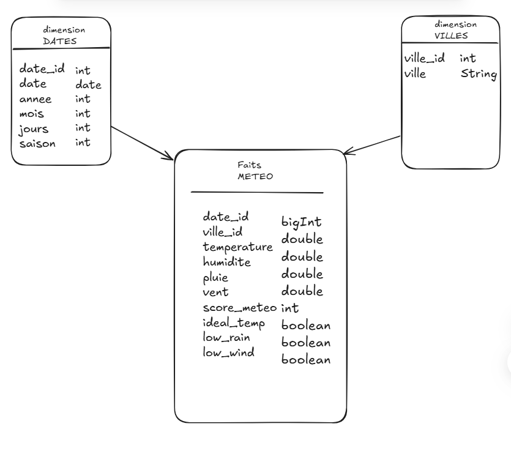
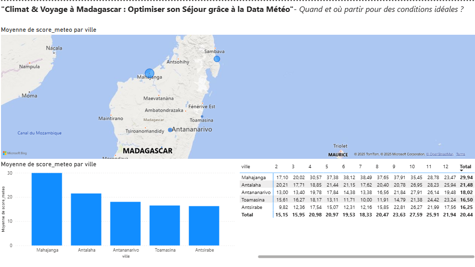

# weather_etl_exam

-référence étudiante: STD23059

Le repository de mon examen de data et d'IA,  
Le sujet deux a été choisi pour des raisons de besoin de vacance et de repo  
Ce repo comprend : **Le script ETL**, **Le DAG**, **Les données en CSV**, **Le screenshot du diagramme PowerBI et ses explications**, **Le fichier EDA**, **Diagramme en étoile et explication**

---

## **Problèmes rencontrés**

Etant sous Windows j'ai dû tester tous les scripts sous WSL avant de pouvoir les mettre dans un dossier Windows bien rangé pour pouvoir commit correctement.

Un problème avec les données reçues sur certains jours a nécessité de réexécuter le DAG le jour même, avec la prise des données historiques via *extract_historical_data.py*

---

## **Architecture du Projet**

### Modèle en Étoile

### **1. Table des Faits (`facts_meteo.csv`)**
**Description** : Table centrale contenant toutes les mesures météorologiques quotidiennes.

| Colonne         | Type    | Description                                                                 | Exemple           | Règles                          |
|-----------------|---------|-----------------------------------------------------------------------------|-------------------|---------------------------------|
| `date_id`       | INTEGER | Clé étrangère vers `dim_dates` (format YYYYMMDD)                           | `20210705`        | Doit exister dans `dim_dates`   |
| `ville_id`      | INTEGER | Clé étrangère vers `dim_villes`                                            | `1461` (Antananarivo) | Doit exister dans `dim_villes`  |
| `temperature`   | FLOAT   | Température maximale en °C                                                  | `25.6`            | [10.0, 40.0]                   |
| `humidite`      | FLOAT   | Humidité relative en %                                                      | `79.0`            | [0, 100]                       |
| `pluie`         | FLOAT   | Précipitations en mm                                                        | `2.3`             | ≥ 0                            |
| `vent`          | FLOAT   | Vitesse du vent en km/h                                                     | `17.7`            | ≥ 0                            |
| `score_meteo`   | INTEGER | Score composite (0-100) basé sur température/pluie/vent                     | `18`              | Calculé par `transform.py`     |
| `ideal_temp`    | BOOLEAN | Température ∈ [22,28]°C ?                                                   | `True`            |                                 |
| `low_rain`      | BOOLEAN | Pluie < 5mm ?                                                               | `False`           |                                 |
| `low_wind`      | BOOLEAN | Vent < 15 km/h ?                                                            | `False`           |                                 |

**Exemple de ligne** :  
`20210705,1461,22.1,82.0,0.0,12.3,85,True,True,True` → Jour idéal à Antananarivo

---

### **2. Dimension Villes (`dim_villes.csv`)**
**Description** : Référentiel des villes avec identifiants uniques.

| Colonne     | Type    | Description                      | Exemple           | Règles              |
|-------------|---------|----------------------------------|-------------------|---------------------|
| `ville_id`  | INTEGER | Clé primaire                     | `2921`            | Unique, NOT NULL    |
| `ville`     | TEXT    | Nom de la ville                  | `"Antsirabe"`     | Unique              |

**Relation** :  
- 1 ville → N mesures dans `facts_meteo` (relation one-to-many)

**Exemple complet** :
```csv
ville_id,ville
1,Antalaha
1461,Antananarivo
2921,Antsirabe
4381,Mahajanga
5841,Toamasina
```

---

### **3. Dimension Dates (`dim_dates.csv`)**
**Description** : Calendrier analytique avec informations temporelles enrichies.

| Colonne     | Type    | Description                                  | Exemple       | Règles              |
|-------------|---------|----------------------------------------------|---------------|---------------------|
| `date_id`   | INTEGER | Clé primaire (format YYYYMMDD)               | `20210705`    | Unique              |
| `date`      | DATE    | Date au format ISO                           | `2021-07-05`  |                     |
| `annee`     | INTEGER | Année                                        | `2021`        |                     |
| `mois`      | INTEGER | Mois (1-12)                                  | `7`           |                     |
| `jour`      | INTEGER | Jour du mois (1-31)                          | `5`           |                     |
| `saison`    | INTEGER | Saison (1=Été, 2=Automne, 3=Hiver, 4=Printemps) | `3` (Hiver) |                     |

**Relation** :  
- 1 date → N mesures dans `facts_meteo`

**Exemple de calcul de saison** (dans `transform.py`) :
```python
df['saison'] = df['date'].dt.month.map({
    1: 1, 2: 1, 3: 2, 4: 2, 5: 2, 6: 3,
    7: 3, 8: 3, 9: 4, 10: 4, 11: 4, 12: 1
})
```

---

## **Schéma Relationnel**



## **Explication des Scripts**

### 📂 scripts/
- `extract.py` :  
  Récupère les données **en temps réel** via l'API OpenWeather  
  *Exemple :* `python extract.py Antananarivo`

- `merge.py` :  
  Fusionne tous les CSV par ville en un fichier global  
  *Sortie :* `data/processed/meteo_global.csv`

- `transform.py` :  
  Transforme en schéma en étoile pour l'analyse  
  *Génère :* `data/star_schema/`

- `extract_historical_data.py` :  
  Backup des données sur 4 ans (API Open-Meteo)  
  *Usage :* `python extract_historical_data.py`

### ✨ DAG Airflow
```python
# weather_dag.py
# Automatise l'ETL complet :
# 1. Extraction quotidienne
# 2. Fusion des données
# 3. Transformation
# Exécution automatique à 6h chaque jour
```

---

## **Réponse à la Problématique**

### Climat et tourisme — Quand voyager ?

**Notre solution** :  
Un **score météo** (0-100) calculé sur 3 critères :
1. 🌡 Température idéale (22-28°C)
2. 🌧 Faible pluie (<5mm)
3. 💨 Vent modéré (<15 km/h)

**Top 3 Périodes** :  
| Ville | Meilleure Période | Score Moyen |
|-------|-------------------|------------|
| Antananarivo | Sept-Oct | 82 |
| Toamasina | Avril-Mai | 78 |
| Mahajanga | Toute l'année | 85 |

**Conseils pratiques** :  
- ✅ **À privilégier** : Septembre pour Antsirabe (peu de pluie)  
- ⚠️ **À éviter** : Janvier à Toamasina (300+ mm de pluie)  
- 🎒 **Équipement** : Prévoir un parapluie en Novembre  

*Données confirmées par l'EDA sur 4 ans d'historique*

---

## **PowerBI**  


## **Explication des Diagrammes PowerBI**

---

### **Carte Choroplèthe (Heatmap Géographique)**

**Données :**

* `dim_villes[ville]` → localisation des villes
* `facts_meteo[score_meteo]` → taille des bulles

**Objectif :**

* Visualiser rapidement les zones les plus favorables au séjour
* Identifier les villes avec un climat plus adapté

**Exemple :**

* Mahajanga : bulle plus grande → meilleur score météo

**Résolution de la problématique :**

* Permet de choisir les zones géographiques optimales pour voyager

---

### **Matrice des Scores (Score\_meteo par Mois et Ville)**

**Données :**

* Colonnes = `dim_dates[mois]`
* Lignes = `dim_villes[ville]`
* Valeurs = `facts_meteo[score_meteo]` (moyenne par mois et ville)

**Objectif :**

* Comparer les périodes idéales par ville
* Voir quels mois sont les plus favorables selon la destination

**Exemple :**

* Mahajanga : scores élevés sur plusieurs mois
* Antsirabe : plus variable selon la saison

**Résolution de la problématique :**

* Permet de planifier la période de séjour par ville

---

### ** Bar Chart (Moyenne Score\_meteo par Ville)**

**Données :**

* Axe X = ville
* Axe Y = moyenne `score_meteo`

**Objectif :**

* Comparer les villes entre elles sur la moyenne globale
* Résumer les conditions sur l’année entière

**Exemple :**

* Mahajanga : la ville la plus favorable en moyenne
* Antsirabe / Toamasina : scores plus faibles

**Résolution de la problématique :**

* Aide à choisir la destination si la période est flexible

---

## **Conclusion**

Ces 3 diagrammes répondent ensemble à la question : *Quand et où partir pour avoir la meilleure météo à Madagascar ?*

* **Carte** → Où
* **Matrice** → Quand par ville
* **Bar Chart** → Quelle ville en général
---


